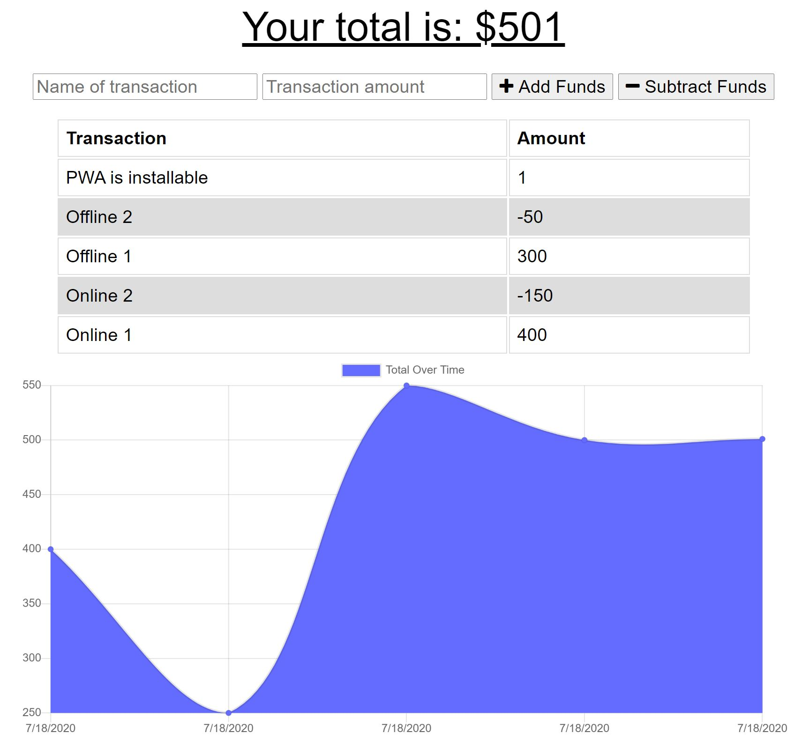

# Budget Tracker PWA 

## Description
This is a budget tracking application using MongoDB for NoSQL, Service Workers for page caching, and IndexedDB for submitting API calls during online choppiness.

## Table of Contents
* [Installation](#Installation)
  
* [Usage](#Usage)

* [License](#License)

* [Questions](#Questions)

## Installation
Installation instructions listed below:
```
npm init -y
npm install
```
  
## Usage
MongoDB is required to use this application. This can also be installed as a Progressive Web Application by hitting the `+` in the address bar of the [deployed appilication](https://tranquil-waters-11401.herokuapp.com/).

```
mongod
npm start
```

[](https://tranquil-waters-11401.herokuapp.com/)

## License
A short and simple permissive license with conditions only requiring preservation of copyright and license notices. Licensed works, modifications, and larger works may be distributed under different terms and without source code.

To view the full license, [click here](./src/license/MIT.txt).

## Questions
If you have any questions, you can find me at [aelisker](https://github.com/aelisker) and via email at [alisker@protonmail.com](mailto:alisker@protonmail.com).
    